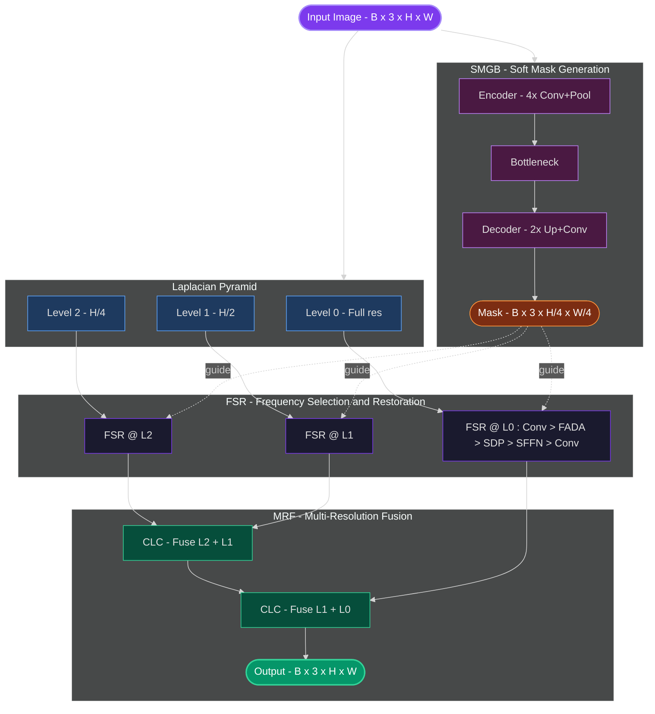

<div align="center">

# FaceRetouchNet

**Deep learning face retouching via spectral restoration**

Based on *"Face Retouching with Diffusion Data Generation and Spectral Restoration"* (ICCV 2025)

[](https://python.org)
[](https://pytorch.org)
[](https://onnx.ai)
[]()

<sub>10.1M params &bull; 256/512 progressive training &bull; tiled inference for 20+ MP portraits &bull; ONNX for C++/Rust plugins</sub>

</div>

---

## Architecture



<table>
<tr><td><b>1.</b></td><td><b>Pyramid</b></td><td>Decompose input into 3 Laplacian frequency scales</td></tr>
<tr><td><b>2.</b></td><td><b>SMGB</b></td><td>U-Net predicts soft blemish mask at &frac14; resolution</td></tr>
<tr><td><b>3.</b></td><td><b>FSR</b></td><td>Frequency-domain restoration at each scale &mdash; FADA + SDP attention + SFFN</td></tr>
<tr><td><b>4.</b></td><td><b>MRF</b></td><td>Bottom-up fusion of restored scales back to full resolution</td></tr>
</table>

---

## Setup

```bash
cd /root/retouch/skin_retouch_dl
uv venv
source .venv/bin/activate
uv pip install torch torchvision torchaudio --index-url https://download.pytorch.org/whl/cu124
uv pip install pyyaml tqdm tensorboard einops pillow scikit-image
uv pip install onnx onnxruntime  # for export
uv pip install lpips             # optional, for evaluation
```

---

## Dataset

Expects **FFHQR** &mdash; 70k paired 1024&times;1024 face images:

| Split | ID Range | Count |
|:------|:---------|------:|
| Train | `00000` &ndash; `55999` | 56,000 |
| Val   | `56000` &ndash; `62999` | 7,000 |
| Test  | `63000` &ndash; `69999` | 7,000 |

```
dataset/
  images1024x1024/    # originals (flat dir: 00000.png .. 69999.png)
  ffhqr/              # retouched  (subdirs of 10k each)
```

---

## Training

```bash
# Train from scratch
python train.py --config configs/default.yaml

# Resume from best checkpoint
python train.py --config configs/default.yaml --resume checkpoints/best.pth

# Resume from specific epoch
python train.py --config configs/default.yaml --resume checkpoints/epoch_030.pth
```

> **Progressive training** is automatic: `256x256` patches (batch 32) &rarr; `512x512` (batch 8) at epoch 30.
> Configure in `configs/default.yaml` under `progressive:`.

```bash
# Monitor with TensorBoard
tensorboard --logdir ./logs --bind_all
```

---

## Evaluation

```bash
# Test split metrics: PSNR, SSIM, LPIPS
python evaluate.py --checkpoint checkpoints/best.pth

# Custom data directories
python evaluate.py --checkpoint checkpoints/best.pth \
    --original-dir /path/to/originals \
    --retouched-dir /path/to/retouched
```

| Target | PSNR | SSIM | LPIPS |
|:-------|-----:|-----:|------:|
| Paper  | >47 dB | >0.990 | <0.013 |

---

## Inference

```bash
# Single image
python inference.py photo.jpg --checkpoint checkpoints/best.pth -o ./output

# Large image (20+ MP) with tiled processing
python inference.py photo.jpg --checkpoint checkpoints/best.pth --tile 1024

# Partial retouching (50% strength blend)
python inference.py photo.jpg --checkpoint checkpoints/best.pth -s 0.5

# Export blemish mask only
python inference.py photo.jpg --checkpoint checkpoints/best.pth --mask-only
```

---

## ONNX Export

> For deployment in **C++/Rust** plugins (GIMP, Darktable) &mdash; no Python dependency needed.

```bash
# Fixed 512x512 tile export
python export_onnx.py --checkpoint checkpoints/best.pth \
    --output face_retouch.onnx

# Dynamic input size (any H/W multiple of 16)
python export_onnx.py --checkpoint checkpoints/best.pth \
    --dynamic --output face_retouch.onnx

# Image-only output (no mask — simpler for plugins)
python export_onnx.py --checkpoint checkpoints/best.pth \
    --image-only --dynamic --output face_retouch.onnx

# With onnx-simplifier
python export_onnx.py --checkpoint checkpoints/best.pth \
    --dynamic --simplify --output face_retouch.onnx
```

---

## Config

Edit `configs/default.yaml`:

| Section | Key | Default | Description |
|:--------|:----|--------:|:------------|
| `model` | `levels` | `2` | Laplacian pyramid levels |
| `model` | `channels` | `64` | FSR feature channels |
| `model` | `fsr_blocks` | `2` | FSR blocks per scale |
| `model` | `window_size` | `8` | SDP attention window size |
| `model` | `patch_size` | `8` | SFFN frequency patch size |
| `train` | `lr` | `5e-4` | Learning rate |
| `train` | `epochs` | `100` | Total training epochs |
| `loss` | `lambda_mask` | `0.1` | Mask BCE loss weight |
| `loss` | `lambda_perceptual` | `0.01` | VGG perceptual loss weight |

---

<div align="center">
<sub><b>~10.1M parameters</b> &bull; Retouched image + blemish mask at &frac14; resolution</sub>
</div>
